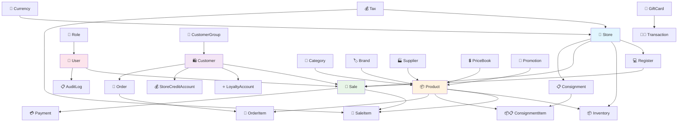

# Entity Relationship Diagram (ERD) Summary

## Core Business Flow



## Detailed Model Relationships

### 🏪 Store Ecosystem
```
Store (Central Hub)
├── Registers (POS terminals)
│   ├── RegisterShifts (work sessions)
│   │   └── CashMovements (cash transactions)
│   └── Payments (transaction payments)
├── Inventory (stock per store)
├── Sales (transactions)
├── Consignments (stock transfers)
├── Users (employees)
└── Orders (e-commerce)
```

### 🛒 Sale Transaction Structure
```
Sale (Transaction)
├── SaleItems (line items)
│   ├── Product (what was sold)
│   ├── SerialNumber (if tracked)
│   ├── SaleItemPromotions (discounts applied)
│   ├── SaleItemSurcharges (additional fees)
│   └── SaleItemTaxComponents (tax breakdown)
├── Payments (how customer paid)
│   ├── PaymentSurcharges (payment fees)
│   └── PaymentExternalAttributes (card details)
├── SaleTaxes (tax summary)
├── SaleAdjustments (manual adjustments)
├── SaleAttributes (additional data)
├── EcomCustomCharges (shipping, etc.)
├── LoyaltyTransactions (points earned/used)
├── GiftCardTransactions (gift card usage)
└── CustomerAccountTransactions (account charges)
```

### 📦 Product Structure
```
Product
├── ProductImages (photos)
├── VariantValues (size, color, etc.)
│   └── VariantAttributes (size, color definitions)
├── Inventory (stock levels per store)
├── ConsignmentItems (in transfers)
├── PriceBookProducts (special pricing)
├── PromotionProducts (eligible for discounts)
├── OutletProductTax (store-specific tax rates)
├── SerialNumbers (individual item tracking)
├── SaleItems (sales history)
├── OrderItems (in orders)
└── CartItems (in shopping carts)
```

### 👤 Customer Ecosystem
```
Customer
├── Addresses (shipping/billing)
├── Orders (e-commerce purchases)
├── Sales (in-store purchases)
├── LoyaltyAccount (points program)
├── StoreCreditAccount (store credit)
├── CustomerAccountTransactions (account activity)
└── Cart (current shopping session)
```

## Database Design Principles

### 🔧 Technical Patterns Used:
- **UUID Primary Keys**: Globally unique identifiers
- **Soft Deletes**: `deleted_at` timestamps instead of hard deletes
- **Audit Trail**: Comprehensive change tracking
- **Polymorphic Relationships**: Flexible entity connections
- **Denormalized Calculations**: Stored totals for performance
- **Multi-tenancy Ready**: Store-based data separation

### 📊 Performance Optimizations:
- Strategic database indexes on frequently queried fields
- Calculated fields stored for complex totals
- Efficient foreign key relationships
- Proper database constraints and unique indexes

### 🔒 Data Integrity:
- Foreign key constraints maintain referential integrity
- Unique constraints prevent duplicate data
- Choice fields ensure valid status values
- Comprehensive field validation

## Common Query Patterns

### Daily Sales Report:
```python
# Sales for a specific store and date
sales = Sale.objects.filter(
    store=store,
    datetime__date=target_date,
    status='COMPLETED'
).prefetch_related('saleitem_set', 'payment_set')
```

### Inventory Check:
```python
# Current stock levels
inventory = Inventory.objects.filter(
    store=store,
    current_quantity__gt=0
).select_related('product')
```

### Customer Purchase History:
```python
# Customer's transaction history
purchases = Sale.objects.filter(
    customer=customer,
    status='COMPLETED'
).order_by('-datetime')
```
